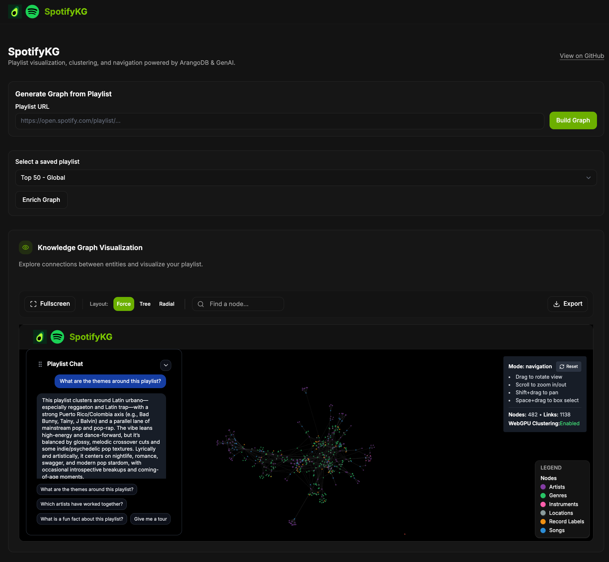
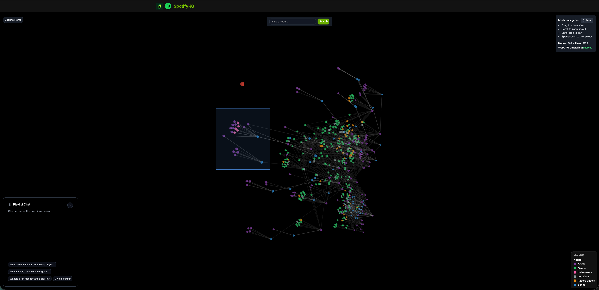
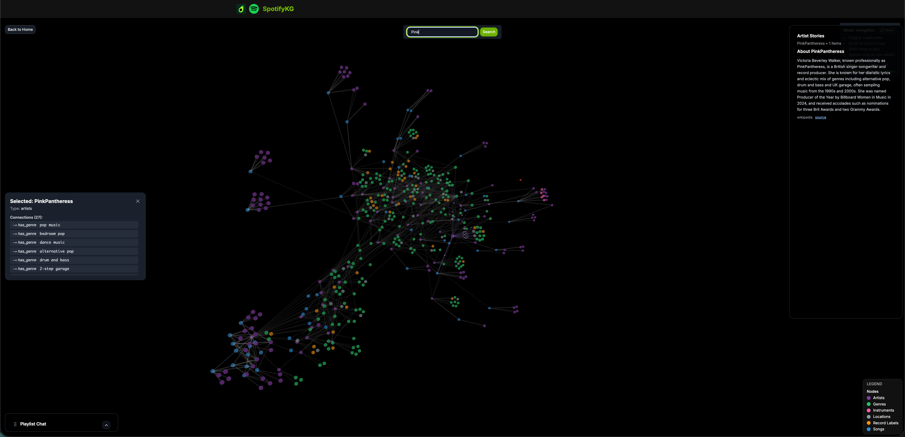

# spotify

[spotify.mahanna.dev](https://spotify.mahanna.dev/)

Turn a Spotify playlist into an explorable story graph.

Built in response to Spotify's push toward richer song context and contributor visibility:
- [Spotlighting the people, connections, and stories behind your music](https://artists.spotify.com/en/blog/spotlighting-the-people-connections-and-stories-behind-your-music)
- [Introducing About the Song (beta)](https://newsroom.spotify.com/2026-02-06/about-the-song-beta/)

UI was forked from the Text2KG NVIDIA Blueprint, which uses ArangoDB: https://www.youtube.com/watch?v=8iA_f_UpzHc

## How it works

1. Paste a Spotify playlist URL in the app.
2. Backend ingests tracks and builds a knowledge graph in ArangoDB.
3. Optional enrichment providers add metadata from 3rd party APIs like Discogs, LastFM, Genius, AudioDB, WikiData (contributors, genres, labels, moods, instruments, etc.).
4. Frontend renders the graph in 3D and supports chat-style exploration of nodes, edges, and clusters.

## Local development setup

### Prerequisites

- Python 3.10+
- Node.js 18+
- ArangoDB running on `http://localhost:8529`

Run ArangoDB with Docker:

```bash
docker run --name arangodb -e ARANGO_ROOT_PASSWORD=test -p 8529:8529 -d arangodb
```

### 1) Configure environment

From the project root:

```bash
cp .env.example .env
```

Fill in API keys in `.env` if you want full enrichment. Core graph build + visualization works with local ArangoDB and defaults.

### 2) Install + run (recommended)

From the project root:

```bash
./start.sh
```

This starts:
- Backend: `http://localhost:5000`
- Frontend: `http://localhost:3000`

### 3) Run services manually (optional)

Backend:

```bash
cd backend
python3 -m venv .venv
source .venv/bin/activate
pip install -r requirements.txt
python main.py
```

Frontend (new terminal):

```bash
cd frontend
npm install
npm run dev
```

|                                                      |                                                    |                                                      |
| :---------------------------------------------------: | :------------------------------------------------: | :--------------------------------------------------: |
|  |  |  |
